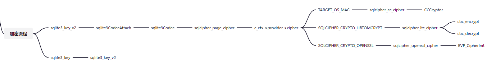

# 已有分析
https://www.jianshu.com/p/208200e0c465
# 官方解密实现(c版)
https://github.com/sqlcipher/sqlcipher-tools/blob/master/decrypt.c
# 加密函数流程
- 基于3.4.2  

# 自己分析
1.先取出第一页头部16字节作为salt  
2.将password与salt进行hmac哈希得到key  
4.取出每一页尾部16字节内容作为每一页的解密iv  
5.分别对每一页执行AES-CBC-256解密  
6.然后将解密后的数据拼接在一块构成解密后的db文件  
# 图示分析
第一页解密，其中header即是db文件头部的16个字节的字符串"SQLite format 3\0" ,null即为空的，与解密无关的，也不会对解密后的db数据有什么影响，具体原因应该是数据加解密前后长度是一样的，那自然iv在解密后自然就没用，但为了保持长度不变，就以null填充了，这里的null可以任意字节，也可以清零  
 
  
其它页解密，其中salt依然是第一页的salt，而iv则是当前页的  
  
  
使用python代码实现其解密机制(暂时仅支持sha1,原始密码解密)  
```python
import os

from Crypto.Cipher import AES


def array_copy(src: bytes, src_pos: int, dest: bytes, dest_pos: int, length: int) -> bytes:
    return dest[:dest_pos] + src[src_pos:length] + dest[dest_pos + length:]


def decrypt_db(password, page_size, kdf_iter, algorithm, db_path):
    """

    :type db_path: str
    :type kdf_iter: int
    :type page_size: int
    :type password: str
    """
    encrypt_db = open(db_path, 'rb').read()
    db_size = len(encrypt_db)
    key = bytes.fromhex(password)
    decrypt_db_file = open(db_path + '.de.sqlite', 'wb')
    decrypt_db_file.write(decrypt_first_page(encrypt_db[:page_size], key))
    for offset in range(page_size, db_size, page_size):
        decrypt_db_file.write(decrypt_page(encrypt_db[offset:offset + page_size], key))


def decrypt_first_page(page_data, key):
    """

    :type key: bytes
    :param key: password
    :type page_data: bytes
    """
    page_size = len(page_data)
    reserve_sz = 48
    page_size -= reserve_sz
    block0 = page_data[16: page_size]
    print('block0 size:', len(block0))
    iv = page_data[page_size:page_size + 16]
    cipher = AES.new(key, AES.MODE_CBC, iv)
    block0 = cipher.decrypt(block0)
    block0 = 'SQLite format 3\0'.encode('utf-8') + block0
    return block0+bytes(reserve_sz)


def decrypt_page(page_data, key):
    """

    :type key: bytes
    :param key: password
    :type page_data: bytes
    """
    page_size = len(page_data)
    reserve_sz = 48
    page_size -= reserve_sz
    block = page_data[: page_size]
    print('block size:', len(block))
    iv = page_data[page_size:page_size + 16]
    cipher = AES.new(key, AES.MODE_CBC, iv)
    block = cipher.decrypt(block)
    return block+bytes(reserve_sz)


if __name__ == '__main__':
    decrypt_db('610BF33C0329251FC503CEEF79D9784307BACE6D8CE066BA4E2BB8AD0E8DB41B', 1024, 64000, 'sha1', 'db.sqlite')
```
