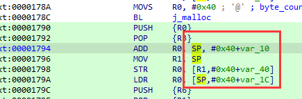

# 修正函数参数长度及类型
- 将鼠标放在目标函数上，然后点击Y键即可修改函数参数了(汇编或伪代码界面皆可)
- 或者菜单->edit->Functions->Set type
- 或者在伪代码界面右键该函数->Set item type
> 参考[IDA-重新设置函数类型、创建数组结构](https://blog.csdn.net/hgy413/article/details/7669369)
# 调用约定
- _cdecl
# IDA 把一个立即数拆分成两个数相加的依据是什么？

> 比如上图，0x30拆分成0x40+var_10 (这里var_10=-0x10)

