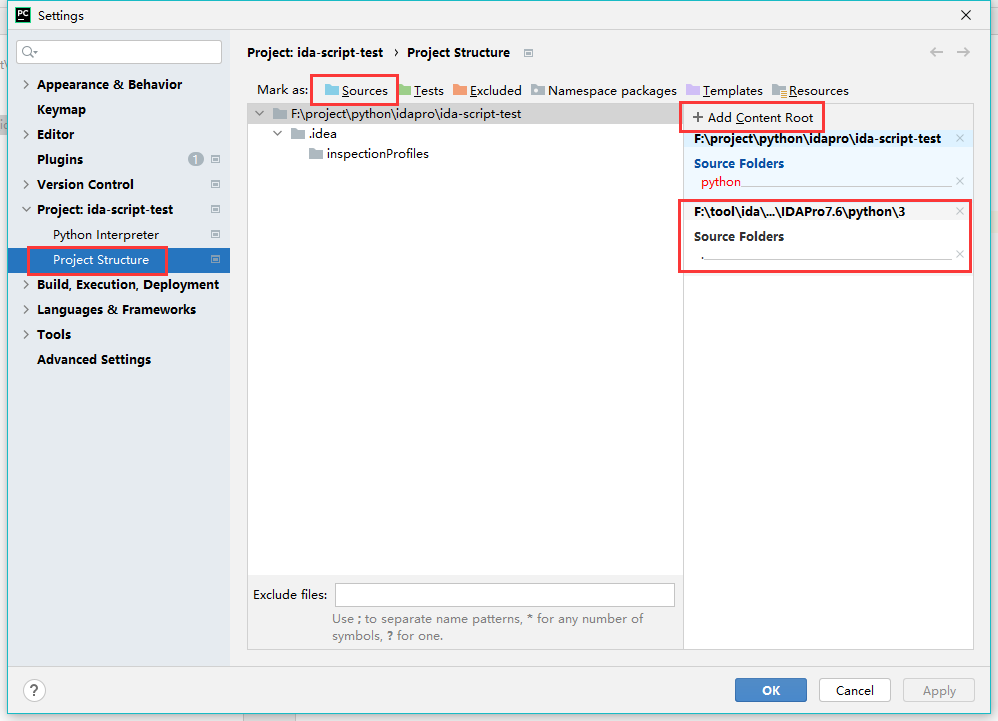

# ida pro权威指南第二版
## 百度云
链接: https://pan.baidu.com/s/1Eco3YG7PszHLIkvxGbCDpQ 提取码: dzta
## 蓝奏云
https://wwa.lanzous.com/irSqBg923vg
# IDA 系列教程
- 1.[IDA：作者花熊](https://blog.csdn.net/hgy413/category_1151311.html)
- 2.[IDA系列教程：IDA Python](https://www.yunyawu.com/2020/06/28/ida-python%E5%AD%A6%E4%B9%A0/)
# IDA 系列脚本
- 1.[flare-ida](https://github.com/fireeye/flare-ida)
- 2.[FLARE IDA Pro的脚本系列：自动化提取函数参数](https://www.freebuf.com/sectool/89273.html)
- 3.[自动化SO字符串解密](https://gaybc.github.io/2019/04/11/%E5%AE%89%E5%8D%93%E9%80%86%E5%90%91-%E8%87%AA%E5%8A%A8%E5%8C%96SO%E5%AD%97%E7%AC%A6%E4%B8%B2%E8%A7%A3%E5%AF%86/)
# IDA 技巧
## pycharm导入idapython api实现自动补全

## ida导入pycharm正开发的脚本

# 常见问题
- IDA启动问题：https://bbs.pediy.com/thread-264346.htm
