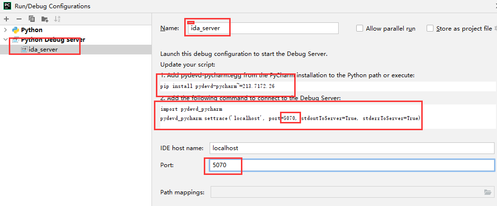
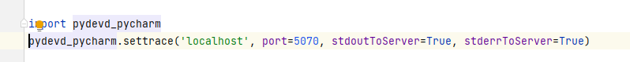
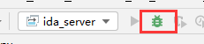

# IDA 中文网
http://www.hex-rays.cn/
# ida pro权威指南第二版
## 百度云
链接: https://pan.baidu.com/s/1Eco3YG7PszHLIkvxGbCDpQ 提取码: dzta
## 蓝奏云
https://wwa.lanzous.com/irSqBg923vg
# IDA 系列教程
- 1.[IDA：作者花熊](https://blog.csdn.net/hgy413/category_1151311.html)
- 2.[IDA系列教程：IDA Python](https://www.yunyawu.com/2020/06/28/ida-python%E5%AD%A6%E4%B9%A0/)
# IDA 系列脚本
- 1.[flare-ida](https://github.com/fireeye/flare-ida)
- 2.[FLARE IDA Pro的脚本系列：自动化提取函数参数](https://www.freebuf.com/sectool/89273.html)
- 3.[自动化SO字符串解密](https://gaybc.github.io/2019/04/11/%E5%AE%89%E5%8D%93%E9%80%86%E5%90%91-%E8%87%AA%E5%8A%A8%E5%8C%96SO%E5%AD%97%E7%AC%A6%E4%B8%B2%E8%A7%A3%E5%AF%86/)
# IDA 技巧
## pycharm导入idapython api实现自动补全

## pycharm 调试idapython插件
- `pip install pydevd-pycharm` 具体安装哪个版本看下图 \

- 在目标py脚本欲调试位置上方加入如下代码

- 点击调试按钮，开启pycharm调试服务 \

- IDA PRO->File->Script file...选择目标py脚本
- 然后就会在上面添加的调试代码位置断下来

## IDA 加快分析速度

这个配置有点烧钱，土豪方案，还有就是经测试，内存磁盘并不能加快解析速度，与普通磁盘解析时间几乎一样

很有用，分析速度大大提升

# IDA 动态调试
- 参考：https://blog.csdn.net/binbin594738977/article/details/106055975
- 常见问题：https://blog.csdn.net/binbin594738977/article/details/106058742
## 调试总结
- android_server(64)要与ida保持统一架构，32位就都是32位，64位就都是64位

# 常见问题
- IDA启动问题：https://bbs.pediy.com/thread-264346.htm
# 参考
- [Pycharm 调试 Idapython](http://nigoule.com/?p=621)
- [ida的F5伪代码里的类型解析](https://hex-rays.com/products/ida/support/idadoc/1361.shtml)
