## 入门

## ubuntu
参考：https://developers.cloudflare.com/warp-client/get-started/linux/  
- 安装
```
# Add cloudflare gpg key
curl -fsSL https://pkg.cloudflareclient.com/pubkey.gpg | sudo gpg --yes --dearmor --output /usr/share/keyrings/cloudflare-warp-archive-keyring.gpg


# Add this repo to your apt repositories
echo "deb [arch=amd64 signed-by=/usr/share/keyrings/cloudflare-warp-archive-keyring.gpg] https://pkg.cloudflareclient.com/ $(lsb_release -cs) main" | sudo tee /etc/apt/sources.list.d/cloudflare-client.list


# Install
sudo apt-get update && sudo apt-get install cloudflare-warp
```
- 使用
```
# 直接上plus，现在直接注册的共享账户已经不能用了，<Name> 替换成你在官网(1.1.1.1)申请的团队名字，
warp-cli teams-enroll <Name>
然后会返回一个链接：
https://<Name>.com.cloudflareaccess.com/warp
在浏览器打开，输入个邮箱验证，该邮箱domain需要符合你的团队domain要求，具体要求看后面详细介绍，验证完后，就注册设备成功了

然后出现一个成功的页面，在该页面检查源代码(ref:[参考文档](https://developers.cloudflare.com/cloudflare-one/connections/connect-devices/warp/deployment/manual-deployment/))

找到如下代码，url后面的内容就是token
<meta http-equiv="refresh" content"=0;url=com.cloudflare.warp://acmecorp.cloudflareaccess.com/auth?token=yeooilknmasdlfnlnsadfojDSFJndf_kjnasdf..." />

然后执行下面这条命令
warp-cli teams-enroll-token com.cloudflare.warp://<your-team-name>.cloudflareaccess.com/auth?token=<your-token>
等待返回success

再执行
warp-cli connect 
等待连接成功

再执行
warp-cli status
查看状态
显示
connected
表示连接成功

再执行
curl https://www.cloudflare.com/cdn-cgi/trace/
查看是否有
warp=plus
则表示切换到了plus版
```

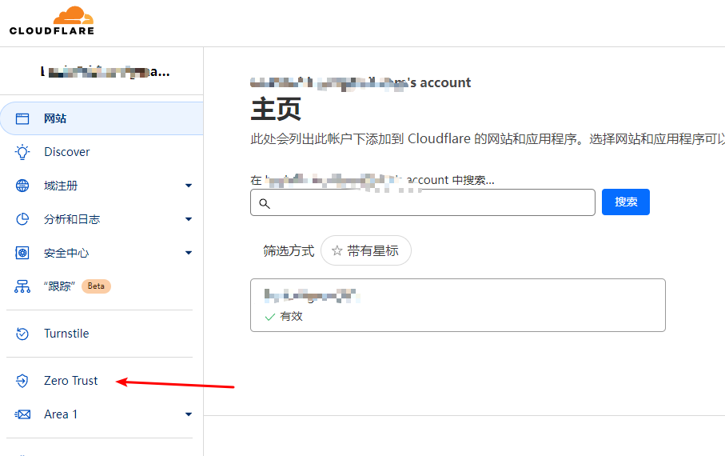

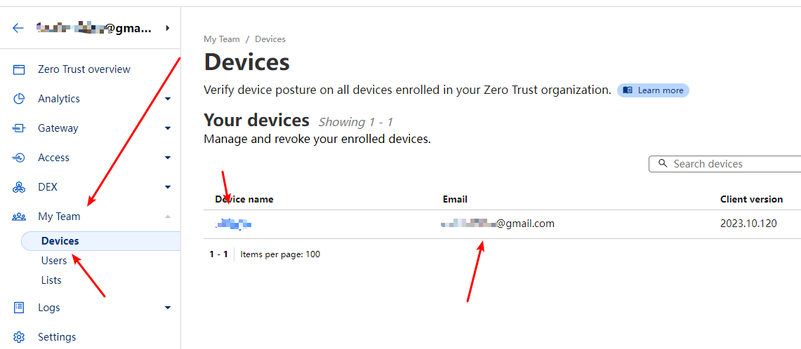


### 客户端注册邮箱策略

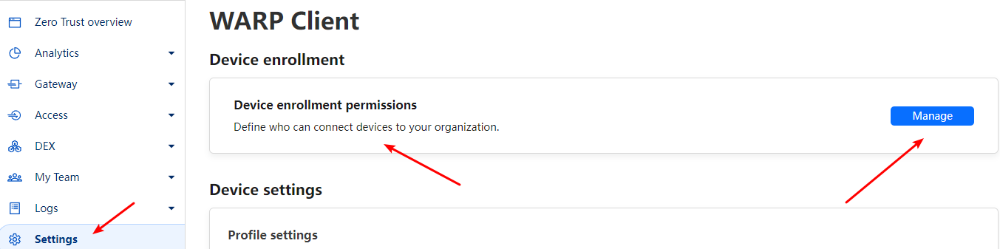


如下，目前策略仅允许gmail邮箱注册，可以在后面添加更对其他邮箱domain支持

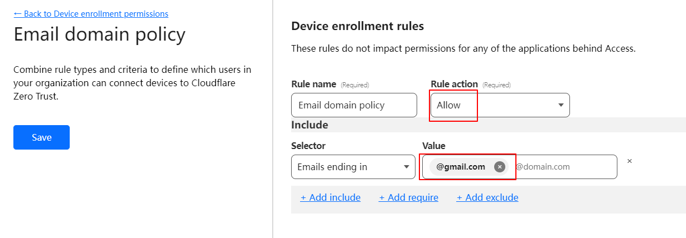

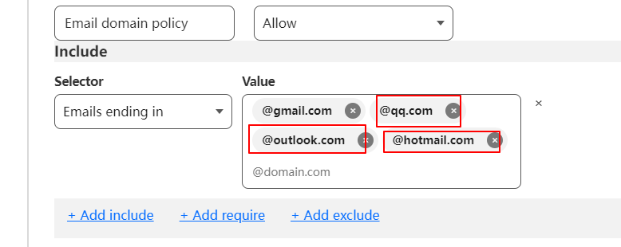

## 进阶

### 排除指定IP或Domain

-> 仅用于团队模式连接

之前一直以为是在本地改的，发现本地客户端只有展示功能，没有修改功能，修改是在云端，具体参考：

[Cloudflare Agent —— 无缝大规模部署](https://blog.cloudflare.com/cloudflare-agent-seamless-deployment-at-scale-zh-cn)

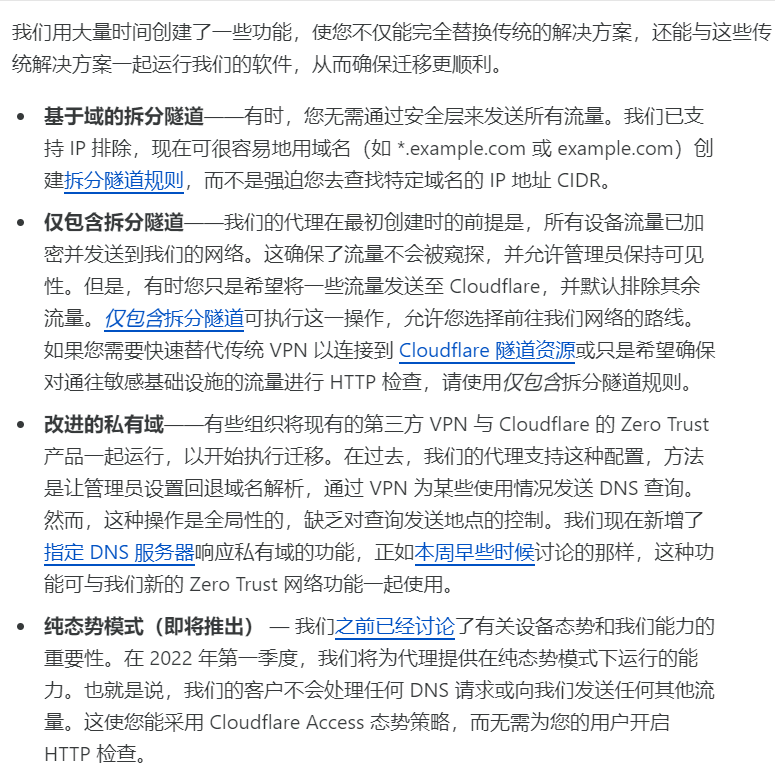

[split-tunnels/#add-a-domain](https://developers.cloudflare.com/cloudflare-one/connections/connect-devices/warp/configure-warp/route-traffic/split-tunnels/#add-a-domain)

具体步骤如下：

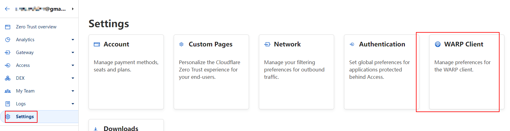

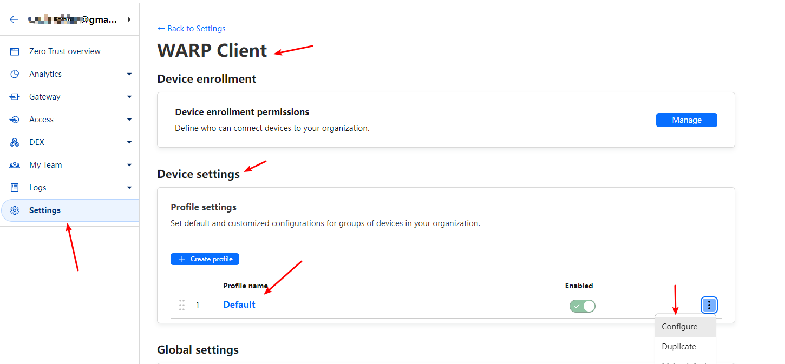

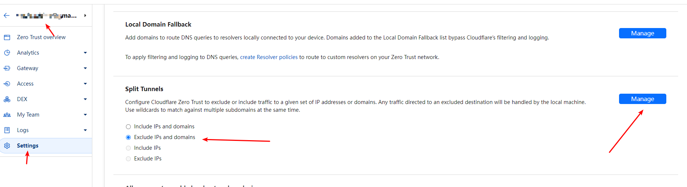

下面添加指定IP地址即可

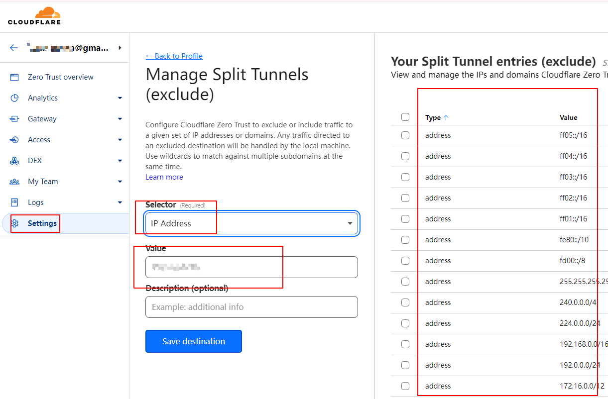

保存后就会自动更新到本地客户端

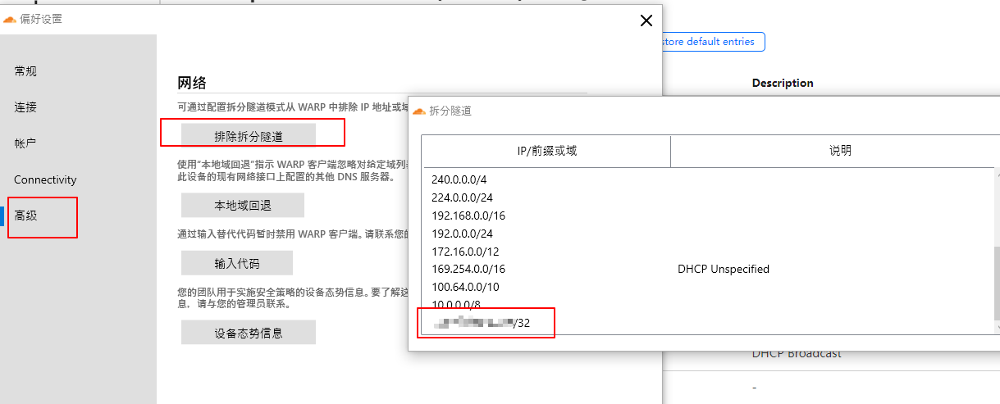

然后这个IP就不会走warp通道了

### 仅代理指定IP或domain

-> 可以仅代理需要魔法的网站，实现机场的效果，这样就获取了一个免费机场，并且相比于机场，这个不用在设置什么代理IP或端口，代理规则啥的，只要一开启，整个系统就仿佛完全进入了国外环境，你在该系统的任意地方，不用任何代理设置，直接就以国外环境访问，省去了各种配置代理的麻烦，什么socks5，http，clash，vmss，ssr等等代理协议

换到这个选项即可 include IPs and domains

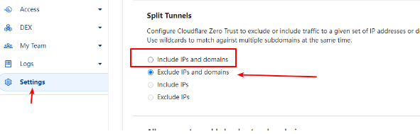

