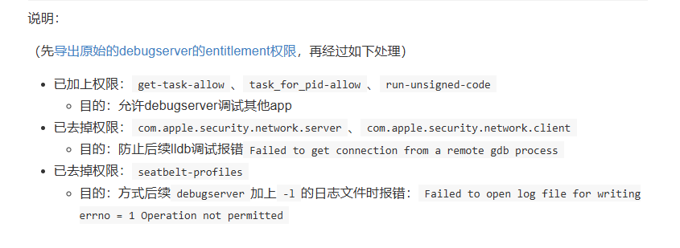

# 目的
在macOS 使用lldb借助USB接口传输ssh通信协议远程调试iphone app
# 测试环境
- iphone6 12.4(已越狱)
- macOS 10.15.5 Catalina
- lldb 1103.0.22.4

# 环境配置

**debugserver** 

> ref: https://book.crifan.org/books/ios_re_debug_debugserver_lldb/website/debugserver/

安装原版debugserver：在设备连接过一次`Xcode`，并在`Window`->`Devices`中添加此设备后，`debugserver`才会被`Xcode`安装到`iOS`的`/Developer/usr/bin/`下（该路径没在系统PATH下，不能直接调用debugserver，需要全路径）

修补debugserver（不修补的没法正常调试其它app）：

```bash
# ssh 端口映射
iproxy 2222 22
```

```bash
# 复制到mac
scp -P 2222 root@127.0.0.1:/Developer/usr/bin/debugserver ./
```

```bash
# 创建entitlements
nano debugserver.entitlements
```

加入如下内容

```xml
<?xml version="1.0" encoding="UTF-8"?>
<!DOCTYPE plist PUBLIC "-//Apple//DTD PLIST 1.0//EN" "http://www.apple.com/DTDs/PropertyList-1.0.dtd">
<plist version="1.0">
<dict>
    <key>com.apple.springboard.debugapplications</key>
    <true/>
    <key>com.apple.backboardd.launchapplications</key>
    <true/>
    <key>com.apple.backboardd.debugapplications</key>
    <true/>
    <key>com.apple.frontboard.launchapplications</key>
    <true/>
    <key>com.apple.frontboard.debugapplications</key>
    <true/>
    <key>com.apple.private.logging.diagnostic</key>
    <true/>
    <key>com.apple.private.memorystatus</key>
    <true/>
    <key>com.apple.private.cs.debugger</key>
    <true/>
    <key>get-task-allow</key>
    <true/>
    <key>task_for_pid-allow</key>
    <true/>
    <key>run-unsigned-code</key>
    <true/>
</dict>
</plist>
```




```bash
# 重新签名
codesign -f -s - --entitlements debugserver.entitlements debugserver
```

```bash
# 复制回iphone的/usr/bin/目录下
scp -P 2222 ./debugserver root@127.0.0.1:/usr/bin/
```


# 步骤[<sup>1</sup>](#ref.1)
- `iproxy 2222 22`:端口转发
- 打开一个新命令窗口
- `ssh -p 2222 root@127.0.0.1`:执行后进入到iphone命令窗口
- `debugserver -x backboard *:1234 /path/to/app/executable`:先启动进程然后注入，注入后会挂起进程
- or `./debugserver *:1234 -a "YourAPPName"`:注入已运行进程
- 打开一个新命令窗口
- `iproxy 1234 1234`
- 打开一个新命令窗口
- `lldb`(执行后进入lldb命令窗口)
- `platform select remote-ios`
- `process connect connect://localhost:1234`[<sup>q1</sup>](#q.1)
- 接下来就可以输入调试命令操作了
# 调试
- `c`:继续运行
- `r`:重启
- `si`:指令级步入
- `ni`:指令级步过
- `return`:退出子函数(测试好像没有这个命令)
- `breakpoint set -a 0x012345`:在函数地址下断
- `dis -a 0x12345`:从某地址开始反汇编
- eg `dis -a $pc`:从当前欲要执行地址开始反汇编
- `image list`:获取执行文件基址
- or `image list -f -o WhatsApp`:增加过滤选项
# script:导入python脚本[<sup>4</sup>](#ref.4)
- `command srcipt import pyFilePath`
# voltron:调试辅助工具(for macOS)
- `git clone https://github.com/snare/voltron.git`
- `cd voltron`
- `./install.sh`:这里执行之后会返回一个entry path，稍后会用到
- 打开一个新命令窗口
- `lldb`
- `command srcipt import {entry path}`:entry path 就是上面的，执行之后会显示`voltron loaded`
-  `voltron init`
- 打开一个新窗口
- `voltron view register`:显示寄存器窗口[<sup>q2</sup>](#q.2)
- `voltron view stack`:显示堆栈窗口[<sup>q2</sup>](#q.2)
- `voltron view disasm`显示汇编窗口[<sup>q2</sup>](#q.2)
- `voltron view backtrace`:显示调用栈[<sup>q2</sup>](#q.2)
- 切换到lldb窗口
- `platform select remote-ios`
- `process connect connect://localhost:1234`[<sup>q1</sup>](#q.1)
- 这时再切换到voltron窗口就可以看到效果了
# 问题
- q1.`error: rejecting incoming connection from ::ffff:127.0.0.1 (expecting ::1)`<a id="q.1"/> \
将*:1234中的'*'改成127.0.0.1[<sup>2</sup>](#ref.2)
- q2.`Exception getting memory from debugger: NameError("name 'xrange' is not defined>`<a id="q.2"/> \
将克隆地址切换到`https://github.com/jonasmr/voltron.git`[<sup>3</sup>](#ref.3)
- q3.


# 参考
- [1] [2018-08-10更新-LLDB常用命令--飘云整理](https://www.dllhook.com/post/51.html)<a id="ref.1"/>
- [2] [IOS越狱12.4之后debugger使用lldb连不上](https://www.ioshacker.net/thread-148-1-1.html)<a id="ref.2"/>
- [3] [fix xrange when using python 3 in lldb. fixes disassembly & registers…](https://github.com/snare/voltron/pull/270)<a id="ref.3"/>
- [4] [脚本模版](https://github.com/ihbing/tool/blob/master/iOS/%E5%8A%A8%E6%80%81%E8%B0%83%E8%AF%95/lldb/lldb_tool.py)<a id="ref.4"/>
