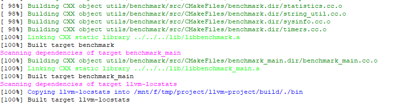
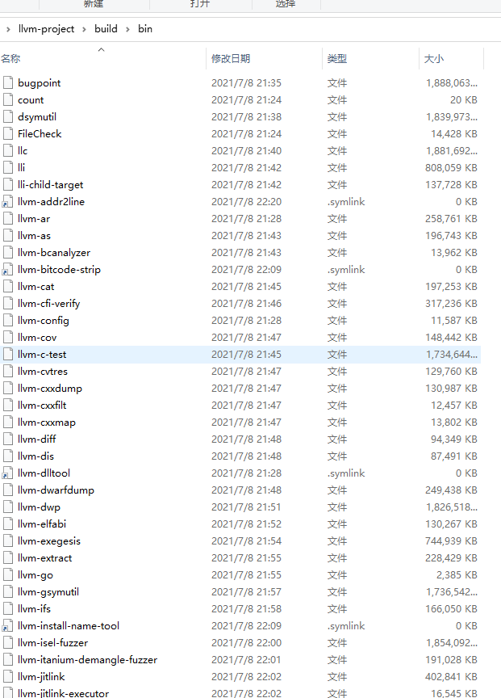

# 简介
# 下载编译
- 环境：Window10 WSL
- 基于llvm-project commit：https://github.com/llvm/llvm-project/tree/31f80393bc06f8eeab35218e1d4476bf120e452e
- 下载编译步骤
```
git clone https://github.com/llvm/llvm-project.git
cd llvm-project
mkdir build
cd build
cmake ../llvm
cmake --build .
```
- 编译成功后返回如下
- 
- 输出的二进制文件在build/bin目录下
- 


# 参考
- https://llvm.org/docs/GettingStarted.html
- https://github.com/llvm/llvm-project
- https://zhuanlan.zhihu.com/p/66793637
