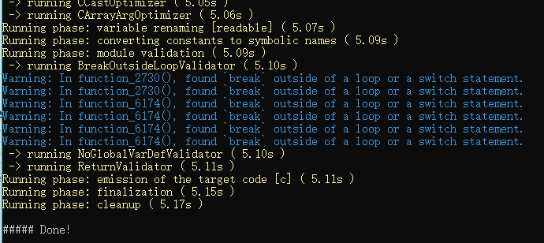

# 官方
https://github.com/avast/retdec/
# 安装
## Window
> 前提条件：1.安装 [Microsoft Visual C++ Redistributable for Visual Studio 2017](https://support.microsoft.com/en-us/help/2977003/the-latest-supported-visual-c-downloads).\
> 前提条件：2.[Python](https://www.python.org/) (version >= 3.4)

- 下载https://github.com/Humenger/tool/releases/tag/retdec
- 解压
# 使用
## Window
- 反编译armeabi-v7a的so
```
python ../retdec-v4.0-windows-32b\retdec\bin\retdec-decompiler.py libwb_security.so
```
> 下载： [libwb_security.so](./libwb_security.so)
- 输出结果\

- 反编译结果
```c

#include <math.h>
#include <signal.h>
#include <stdbool.h>
#include <stdint.h>
#include <stdlib.h>
#include <string.h>
#include <wchar.h>

//......

// Address range: 0x15a4 - 0x16f2
int32_t stringEncrypt_cplusplus(int32_t a1, int32_t a2, int32_t a3, int32_t a4) {
    // 0x15a4
    uint32_t v1; // 0x15a4
    if (a1 == 0 || (char)v1 == 0) {
        // 0x16ea
        return 0;
    }
    int32_t v2 = *(int32_t *)(v1 % 256 + 676); // 0x15d8
    int32_t v3 = function_9a10(a1, -1, 0, v2); // 0x15f2
    int32_t result = 0; // 0x15f8
    if (v3 != 0) {
        int32_t v4 = 4; // bp-24, 0x1600
        int32_t v5 = function_9a20(80, -1, 0, v2); // 0x1604
        function_3664(a1, a1, v3, v5, &v4);
        function_9a30(3, "WbSecurity", "[%s@%d]len = %d, output = %s", "D:/HiCloud_codes/Global_20191227/HwCloudDrive/Source/ModuleFileManager/jni/WbSecurity.cpp", 54, 4, v5);
        function_9a40(v5, a3, a1, *(int32_t *)(a1 + 680));
        result = a1;
    }
    // 0x16ea
    return result;
}

// Address range: 0x1700 - 0x185a
int32_t stringDecrypt_cplusplus(int32_t a1, int32_t a2, int32_t a3, int32_t a4) {
    int32_t result = 0; // 0x172c
    int32_t v1; // 0x1700
    if (a1 != 0 && (char)v1 != 0) {
        // 0x1738
        function_9a30(3, (char *)((int32_t)&g35 + 0x177c), "p", "s", 84, a1, a1);
        int32_t v2 = 0; // bp-24, 0x1788
        int32_t v3 = function_9a20(64, (int32_t)&g35 + 0x177c, (int32_t)"p", (int32_t)"s"); // 0x178c
        function_2730(a1, a1, a1, v3, &v2);
        int32_t v4 = v2 + 1; // 0x17b2
        int32_t v5 = function_9a20(v4, a1, a1, v3); // 0x17b8
        function_3806(v5, v4, v3, v2);
        *(char *)(v2 + v5) = 0;
        function_9a30(3, (char *)&g38, "[%s@%d]len = %d, output = %s", "s", 94, v2, v5);
        function_9a40(v3, a3, a1, 0);
        function_9a40(v5, a3, a1, 0);
        result = a1;
    }
    // 0x1852
    return result;
}

// Address range: 0x1874 - 0x18e8
int32_t JNI_OnLoad(int32_t a1) {
    // 0x1874
    function_9a30(3, "WbSecurity", "[%s@%d]JNI_Onload", "D:/HiCloud_codes/Global_20191227/HwCloudDrive/Source/ModuleFileManager/jni/WbSecurity.cpp", 143, (int32_t)&g45, (int32_t)&g45);
    int32_t v1; // 0x1874
    return a1 != 0 | v1 == 0 ? -1 : v1 >> 31 | (int32_t)&g1;
}

//......
```
> 对比了IDA的反编译结果，差的有点远，很多代码都丢失了
- 反编译IR
```lr

define i32 @JNI_OnLoad(i32 %arg1) local_unnamed_addr {
dec_label_pc_1874:
  %0 = call i32 @__decompiler_undefined_function_0()
  %1 = call i32 @function_9a30(i32 3, i8* getelementptr inbounds ([11 x i8], [11 x i8]* @global_var_9da4, i32 0, i32 0), i8* getelementptr inbounds ([18 x i8], [18 x i8]* @global_var_9e34, i32 0, i32 0), i8* getelementptr inbounds ([90 x i8], [90 x i8]* @global_var_9dcc, i32 0, i32 0), i32 143, i32 ptrtoint (i32* @0 to i32), i32 ptrtoint (i32* @0 to i32)), !insn.addr !90
  %2 = icmp ne i32 %arg1, 0, !insn.addr !91
  %3 = icmp eq i32 %0, 0, !insn.addr !92
  %or.cond = or i1 %2, %3
  %4 = ashr i32 %0, 31
  %5 = or i32 %4, ptrtoint (i32* @global_var_10006 to i32)
  %r5.0 = select i1 %or.cond, i32 -1, i32 %5
  ret i32 %r5.0, !insn.addr !93
}

```
### 问题
- 1. 
```
 error: unterminated attribute group
attributes #0 = { nounwind readnone speculatable }
```
# 参考
- https://www.bookstack.cn/read/CTF-All-In-One/doc-5.11.1_retdec.md
- 
