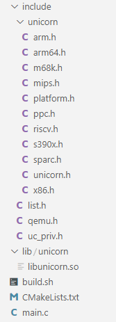

# 编译unicorn arm版
- 下载源码
```
# 我下载时的commit id:c10639fd4658a852049546162d116b123e2b1ec2
git clone https://github.com/unicorn-engine/unicorn.git
```
- 将以下构建脚本放入项目根目录，然后修改相应路径，最后通过`source ./build.sh`命令执行即可
```sh
# build.sh
# source ./build.sh

rm -rf build

mkdir build

cd build

export JAVA_HOME=/data/tool/android/android-10.0.0_r2/prebuilts/jdk/jdk8/linux-x86

export NDK=/data/tool/sdk/sdk/ndk-bundle

export ABI=armeabi-v7a

export MINSDKVERSION=16

export PATH=$PATH:$JAVA_HOME:/data/tool/sdk/sdk/cmake/3.18.1/bin:$NDK/toolchains/arm-linux-androideabi-4.9/prebuilt/linux-x86_64/bin

echo "exec cmake..."

cmake .. -DCMAKE_TOOLCHAIN_FILE=$NDK/build/cmake/android.toolchain.cmake -DANDROID_ABI=$ABI -DANDROID_NATIVE_API_LEVEL=$MINSDKVERSION

echo "exec make..."

make

cd ../

echo "finish"

```
# 调用unicorn
- 项目结构 \ 

- CMakeLists.txt
```cmake
cmake_minimum_required(VERSION 3.4.1)
project(test002 VERSION 1.0)

include_directories(include)

link_directories(lib/unicorn)

add_executable(test002 main.c)

target_link_libraries(test002 libunicorn.so m)

```
- main.c
```c
#include <stdio.h>
#include <stdint.h>
#include <stdlib.h>
#include <string.h>
char *to_hex(const uint8_t *buf, uint32_t size) {
    char*hex_char="0123456789abcdef";
    uint8_t hv,lh;
    char * ret= malloc(size*2+1);
    *(ret+size*2)='\0';
    for (int i = 0,j=0; i < size; ++i,j+=2) {
        hv=(*(buf+i)&0xf0)>>4;
        lh=*(buf+i)&0x0f;
        *(ret+j)=*(hex_char+hv);
        *(ret+j+1)=*(hex_char+lh);
    }
    return ret;
}
void to_bytes(char*hex,uint8_t **bytes,uint32_t* size){
    char*hex_char="0123456789abcdefABCDEF";
    size_t hex_len=strlen(hex);
    *bytes= malloc(hex_len/2);
    *size=hex_len/2;
    uint8_t hi,li;
    for (int i = 0; i < *size; ++i) {
        hi=strchr(hex_char,*(hex+i*2))-hex_char;
        li=strchr(hex_char,*(hex+i*2+1))-hex_char;
        hi=hi>15?(hi-6):hi;
        li=li>15?(li-6):li;
        *(*bytes+i)=(hi<<4)|li;
    }
}

#include "unicorn/unicorn.h"
#define ADDRESS 0x8000
int main() {
    uc_engine *uc;
    uint32_t r2;
    // 汇编代码           指令
    // mov r0,1        0xE3A00001
    // mov r1,2        0xE3A01002
    // add r2,r0,r1    0xE0802001
//    uint32_t  code[]={0xE3A00001,0xE3A01002,0xE0802001};
    uint8_t *codePtr;
    uint32_t len;
    to_bytes("ff4304d1f44f0fa9fd7b10a9fd030491f30302aae20301aae10300aaa80c01d008ad45f9080140f9a8831ef8a8dc00d00029c13d1f2003d5012dc13de00700ad1f2003d5007142fde01300fde00300915afeff97e0030091e10313aa6effff97a8835ef8a90c01d029ad45f9290140f93f0108eba1000054fd7b50a9f44f4fa9ff430491c0035fd64fa96894",
             &codePtr,&len);
    uc_open(UC_ARCH_ARM,UC_MODE_ARM,&uc);
    uc_mem_map(uc,ADDRESS,1024*4,UC_PROT_ALL);
    uc_mem_write(uc,ADDRESS,codePtr,280/2);
    uc_emu_start(uc,ADDRESS, ADDRESS+280/2,0,0);
    uc_reg_read(uc,UC_ARM_REG_R2,&r2);
    printf("r2=%d\n",r2);
    uc_close(uc);
    return 0;
}

```
# 运行
```sh

adb push test001 /data/local/tmp/

adb push libunicorn.so /data/local/tmp/

adb shell

cd /data/local/tmp/

export LD_LIBRARY_PATH=$LD_LIBRARY_PATH:/data/local/tmp/

./test001

```
