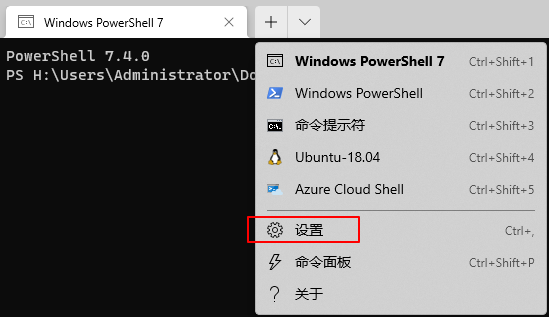

## 更新PowerShell
- 安装新版本：`iex "& { $(irm https://aka.ms/install-powershell.ps1 -UseBasicParsing) }"`
- 设为默认版本
  - 点击设置  
  
  - 点击`添加新配置文件`
  - 将新版本的powershell路径添加进去
  - 然后在启动选项里将该新配置设置默认配置文件
## 添加命令别名
> 注意不是PowerShell里的Alias别名
- 创建Powershell配置文件，若已创建则跳过
```
New-Item $profile -force -itemtype file
```
- `notepad $profile` 编辑配置文件
- 按如下格式添加命令
```
function 别名 { 需要替代的命令 }
```
eg.
```
remove-item alias:history # 可选，删除默认的别名，否则会先调用默认的
function history { cat C:\Users\xxx\AppData\Roaming\Microsoft\Windows\PowerShell\PSReadLine\ConsoleHost_history.txt }
```
- 然后执行`Set-ExecutionPolicy RemoteSigned` 生效更改
- 重启PowerShell即可

## 参考
- [如何永久删除默认的 Powershell 别名？](https://superuser.com/questions/883914/how-do-i-permanently-remove-a-default-powershell-alias)
- [为 Windows PowerShell 设置 alias （命令行命令别名）](https://blog.csdn.net/lei_qi/article/details/106592404)
- [PowerShell 升级和 Windows Terminal 配置 PowerShell](https://zhuanlan.zhihu.com/p/401439255)
